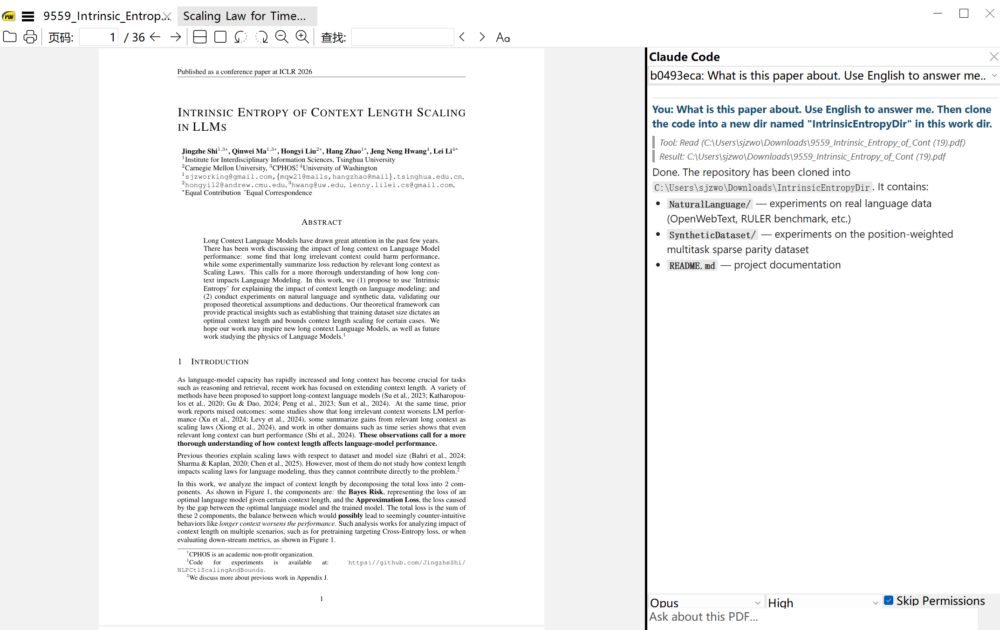

## SumatraPDF Reader

SumatraPDF is a multi-format (PDF, EPUB, MOBI, CBZ, CBR, FB2, CHM, XPS, DjVu) reader
for Windows under (A)GPLv3 license, with some code under BSD license (see
AUTHORS).

More Information:
* [Website](https://www.sumatrapdfreader.org/free-pdf-reader)
* [Manual](https://www.sumatrapdfreader.org/manual)
* [Developer Information](https://www.sumatrapdfreader.org/docs/Contribute-to-SumatraPDF)

---

### Claude Code Integration

This fork adds a Claude Code sidebar to SumatraPDF. Press `Ctrl+Shift+E` to open a chat panel on the right side of the viewer.



Claude Code runs in the current PDF's directory, with a system prompt telling it which PDF you're viewing. You can switch between different Claude Code sessions via a dropdown, and conversations persist across app restarts.

Implementation: `src/ClaudeCode.cpp` (~1400 lines) spawns the Claude CLI (`claude -p --output-format stream-json`) via `CreateProcessW`, parses streaming JSON output, and renders it as markdown in a WebView2 panel. Session state is stored per-tab in `WindowTab`.

### Installation

1. Install [Claude Code](https://docs.anthropic.com/en/docs/claude-code) on Windows.
2. Clone this repo and `cd` into it:
   ```bash
   git clone https://github.com/JingzheShi/sumatrapdf-claudecode.git
   cd sumatrapdf-claudecode
   ```
3. Run `claude` and ask it to build the project:
   > Please help me build this repo. Install any dependencies you can (e.g. bun, cmake). If something requires manual installation (e.g. Visual Studio 2026), let me know and tell me how to do it.
